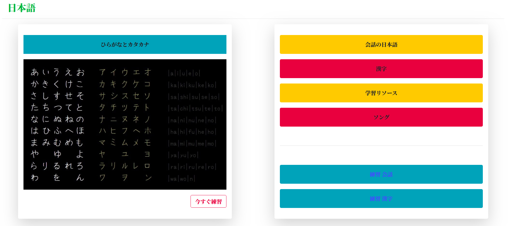
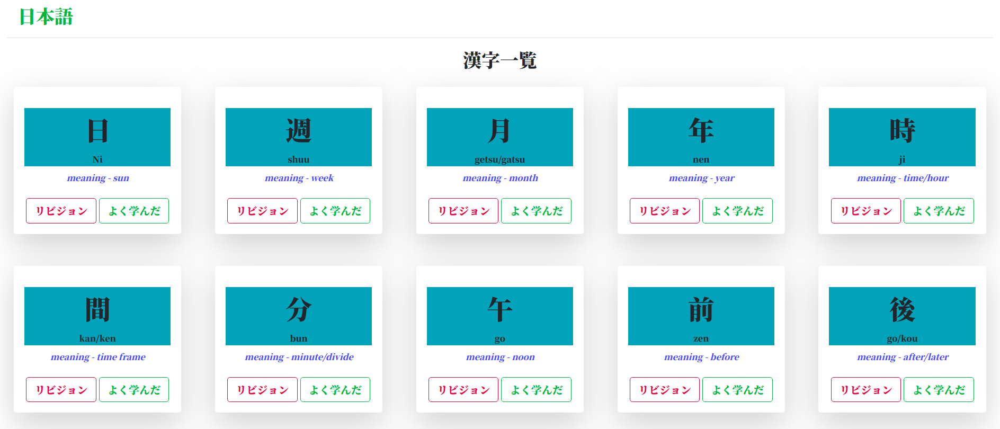
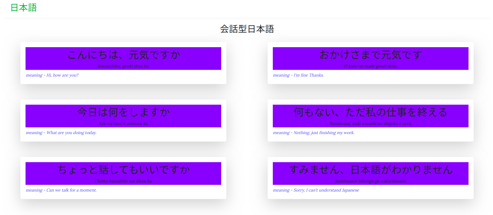

# 日本語を学ぶ
このツールの助けを借りて、誰でも基本的な日本語の練習を始め、これまでに学んだことを追跡することができます。

## スクリーンショット

### ホームページ

### 漢字リスト

### 会話日本語

## ユーザーガイド
* git clone https://github.com/pandeyroshan/Learn-Japanese.git
* cd Learn-Japanese/
* python manage.py runserver

## 特徴
* ひらがなとカタカナの練習表
* 会話の日本語
* 漢字
* 日本の歌

## 助ける
* プルリクエストを開く